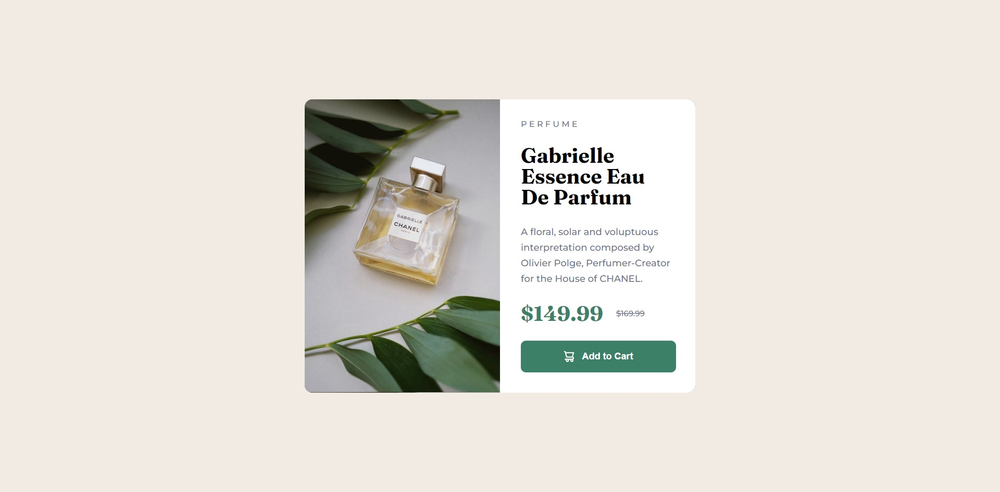

# Frontend Mentor - Product preview card component solution

This is a solution to the [Product preview card component challenge on Frontend Mentor](https://www.frontendmentor.io/challenges/product-preview-card-component-GO7UmttRfa). Frontend Mentor challenges help you improve your coding skills by building realistic projects. 

## Table of contents

  - [The challenge](#the-challenge)
  - [Screenshot](#screenshot)
  - [Links](#links)
  - [Built with](#built-with)
  - [What I learned](#what-i-learned)
  - [Author](#author)

### The challenge

Users should be able to:

- View the optimal layout depending on their device's screen size
- See hover and focus states for interactive elements

### Screenshot

### Links

- Solution URL: [https://caioalberto97.github.io/Product-preview-card-component/e](https://caioalberto97.github.io/Product-preview-card-component/)

### Built with

- Semantic HTML5 markup
- CSS custom properties
- Flexbox

### What I learned

Found a way to center my containers with:
.container {
    position: absolute;
    top: 0; bottom: 0; left: 0; right: 0;
    margin: auto;
}

## Author

- Frontend Mentor - [@CaioAlberto97](https://www.frontendmentor.io/profile/CaioAlberto97)
